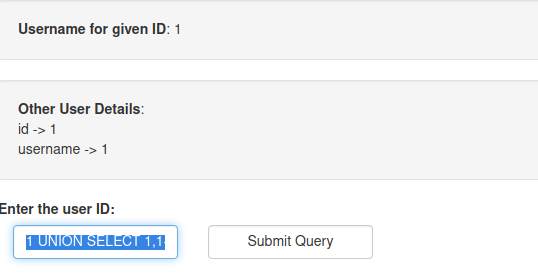
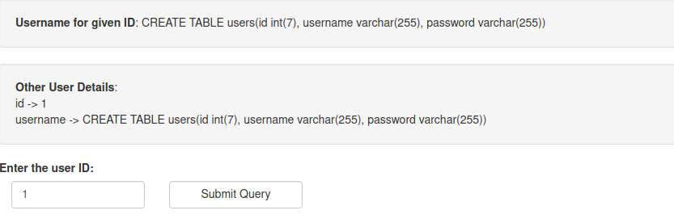
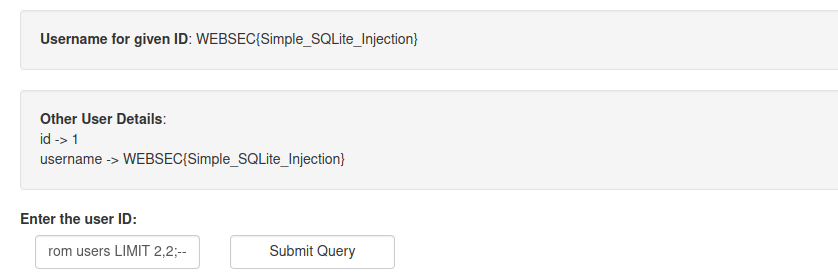

# level01:

## analysis:

* we can notice from the php code that our input is getting concatenated to a sql query 

* the query is fetching id,username from a table called users

* it apply a LIMIT 1 so we can only fetch one result composed of and id and a username

## vulnerability:

our input getting added to a sql query without filtering! clearly a sql injection 

## exploitation: 

first we use this payload ```1 UNION SELECT 1,1--``` so we can notice we get the response in 2 fields id and username



then i wanted to know which field i will use to extract data using this payload ```1 UNION SELECT sqlite_version(),1--``` and ```1 UNION SELECT 1,sqlite_version()--```

with the second payload i got the response **username -> 3.27.2** so i will use the second field

reading more about sqlite we can understand that **sqlite_master** is the equivalent of **information_schema** in other DBMS. and it contains a field named **sql**. the sql field is the text of the original CREATE TABLE or CREATE INDEX statement that created the table or index.

we can use this payload to check how the table was created ```1 UNION select 1,sql from sqlite_master;--```



let's now extract the password with this payload ```1 UNION select 1,password from users;--```

but we only get the the first user result and that's perfectly normal because we are using a UNION here

we can add a LIMIT clause to specify which password we need and the final payload will be 
```1 UNION SELECT 1,password from users LIMIT 2,2;--```



another solution is ```1 UNION SELECT 1, GROUP_CONCAT(password) FROM users;--``` read about GROUP_CONCAT and it will make sense

