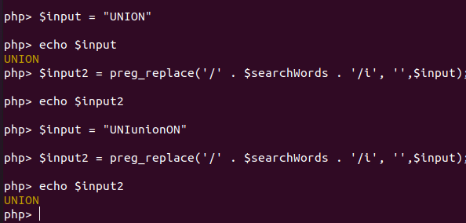

# level02:

## analysis:

we can see in this script that we still have our sqlinjection but our input is getting filtred with ```$searchWords = implode (['union', 'order', 'select', 'from', 'group', 'by'], '|');``` and if it matches **$searchWords** it get replaced with an empty string

## vulnerability:

**preg_replace()** will only replace the first occurence of the filtred input it can easly be bypassed

## exploitation:



it's obvious now payload is ```1 UUNIONNION SSELECTELECT 0, password FFROMROM users LIMIT 1;```
