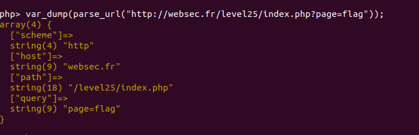

# level25:

## analysis:

in this challenge i was tricked thinking that i need to find a vulnerability in **stripos** but the true vulnerability was in **parse_url()** function

## vulnerability:



we can see how **parse_url()** behave in localy(i'm running php7 it's not exploitable locally but it's just to see how it separate the url) reading this bug submit https://bugs.php.net/bug.php?id=74780 we can see how the path can be manipulated and making HOST null

## exploitation:

```http://websec.fr/level25/index.php?page=flag&:1337```
